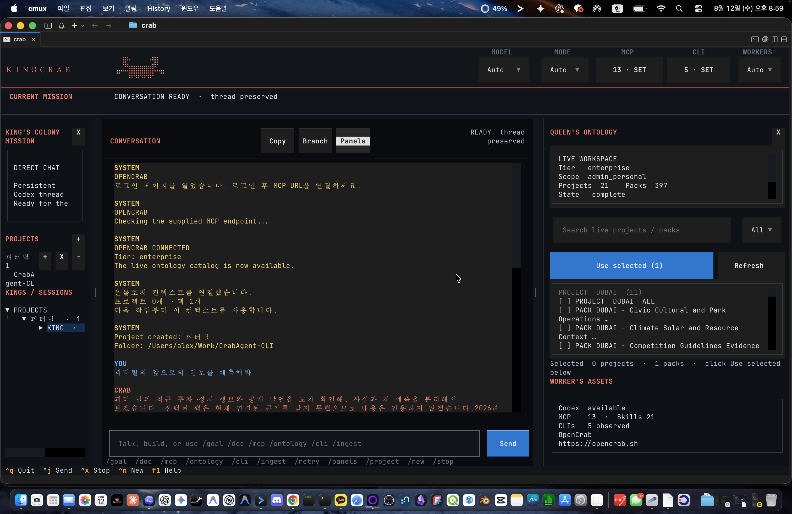

# KINGCRAB CLI

KINGCRAB is a local-first, ontology-oriented coding agent built as an extended
world of OpenCrab `opencrab.sh`. The public command remains `crab` for
compatibility, with `kingcrab` as the branded alias. It opens a Hermes-style command deck and automatically owns
or reconnects to an internal durable runtime. Closing the panel never means
that an active mission was cancelled.



This repository is the public Apache-2.0 distribution of KINGCRAB. The
runtime is local-first: credentials, live OpenCrab state, SQLite files, logs,
and mobile pairing tokens stay in the ignored `.crabagent/` directory and are
never part of a source checkout or commit.

## Platform support

**KINGCRAB supports macOS natively and Windows through WSL2.** The TUI,
local `crabd` runtime, Codex integration, and onboarding flow run unchanged
inside an Ubuntu WSL2 environment. Native Windows and standalone Linux are
not currently supported or verified.

`crabd` accepts only requests that carry the workspace token in
`.crabagent/runtime-auth.json` (mode 0600). Its socket lives in the private
`/tmp/crabagent-<uid>/` directory (or `CRABAGENT_RUNTIME_DIR`), and the
workspace state, colony database, config, pid and log files are readable only
by their owner. The first start after upgrading stops a daemon still bound to
the old `/tmp/crabagent-<hash>.sock` path.

## Role system

| Role | Responsibility | SOLTELU route |
| --- | --- | --- |
| KING | Goal, task graph, workflow and pipeline design | `gpt-5.6-sol / high` |
| QUEEN | Ontology retrieval, planning and context provisioning | `gpt-5.6-terra / medium` bounded, `high` strategic |
| WORKER | Bounded coding and tool work | `gpt-5.6-luna / low` |
| SOLDIER | Waste control, quality defense and external scouting | `gpt-5.6-luna / low-medium` |
| ORACLE | Final evidence and artifact verification | `gpt-5.6-sol / high` |

The route planner is honest: it records `planned` until the official Codex App
Server returns a turn receipt. Unsupported SOLTELU aliases fall back visibly to
the authenticated Codex session default instead of claiming the requested model
ran. The deterministic demo spends no model tokens and remains clearly labeled.

## Why KINGCRAB instead of a direct Codex turn

KINGCRAB is useful only when its goal compiler changes the work. The honest
comparison target is one direct Codex/Claude turn with optional OpenCrab access,
not a fixed five-role demo. Every execution request is classified before a model
call into a bounded kinetic plan:

- Clear code work: local KING gate -> one WORKER turn -> local ORACLE receipt gate.
- Ontology work: the runtime receives one bounded read-only `opencrab_query`
  response from the configured OpenCrab MCP, persists it as
  `mcp_context_receipt`, then chooses the cheapest honest Queen path. Exact
  list/count/status lookups and bounded evidence briefs use a local Queen
  projection with zero model turns; recommendation, comparison, graph and
  semantic questions use a model Queen. A
  local ORACLE gate closes simple evidence questions; a model Oracle is added
  only for graph, external, write, or high-risk goals.
- Bounded ontology-backed writes keep the Worker model turn but close Oracle
  locally after artifact, test and evidence checks. Oracle model review is
  reserved for strategic, graph, external or high-risk work.
- External or risky work: SOLDIER owns scope and waste patrol; it escalates only
  when scouting or judgment cannot be done locally.

The plan is persisted as `goal_plan.json`, includes the ontology spaces and
estimated model turns, and uses a bounded MCP context projection rather than
repeating a full catalog or transcript. A role that is skipped is recorded as a local gate;
the panel never fabricates a worker or token saving.

The stronger differentiator is the persisted `goal_graph.json`. KINGCRAB does
not treat a pack as a blob appended to a prompt. It compiles one objective into
goal, scope, evidence slots, decision slots, action/output and verification
nodes. The provider receives that small operational graph, while OpenCrab MCP
receipts remain the authority that fills the evidence slots. The standard loop
is `restate goal -> scope -> retrieve -> draft/execute -> judge -> publish or
stop`; a failed gate becomes a durable retry boundary rather than another
unbounded harness pass.

The execution contract makes that difference enforceable. Every ontology
mission also persists `ontology_execution_contract.json`: required evidence
slots are filled only by observed MCP IDs, source URIs and captured text, while
decision slots are filled by the Queen's structured path/claims/action output.
SOLDIER blocks a missing slot and ORACLE cannot synthesize a final result until
the coverage and decision gates pass. This is the key move from “an agent with
pack context” to “an agent whose work is shaped and admitted by ontology
slots”.

The current runtime makes the role path executable rather than descriptive. Every
mission now persists `kinetic_workflow.json` and, after running,
`kinetic_workflow_state.json`. These records show the actual operator order:
`goal_bind -> scope_lock -> retrieve -> bind -> decide -> patrol -> execute ->
verify`. A panel can therefore show which gate really ran instead of inferring
activity from role names.

Catalog lookup has a separate `metadata_observation` gate. Typed pack/project
rows stay typed as `observed_items`; they are not flattened into fake evidence
chunks. A list request can finish with zero model turns, while a content claim
still requires `claim_gate=pass`, source URI and captured text. This is the
practical distinction between a fast ontology catalog operation and an
evidence-grounded answer.

When KING is model-backed, its bounded `king_plan.json` becomes the packet for
QUEEN, WORKER and ORACLE: subgoals, constraints, success checks and the next
action are carried forward without replaying the full King transcript. The
packet is advisory; the user goal, compiled graph and observed OpenCrab receipt
cannot be overridden by model prose. If Queen's evidence handoff is malformed,
SOLDIER can spend one budget-bound repair pass before any workspace write. A
large or already-spent turn is stopped instead of silently retried.

For strategic ontology research or planning, KING's bounded subgoals can also
become real `king_subgoal` Worker slots. The runtime admits no more than the
configured Worker capacity, inserts the slots durably before ORACLE, and runs
them as serial read-only projections over the observed MCP evidence. This
adds a visible multi-worker evidence fan-out without another provider turn,
without treating pack count as worker count, and without permitting a
read-only subgoal Worker to edit the workspace.

Each admitted subgoal carries only its assigned `evidence_slot_ids` and emits
`slot_coverage` in its receipt. Increasing the Worker cap therefore increases
bounded capacity, not duplicated full-context prompting or one-worker-per-pack
inflation.

This distinction is useful for ontology-heavy work: direct Codex can call the
same MCP, but KINGCRAB makes the required evidence, decision shape and Oracle
acceptance explicit before the turn starts. That is a structural advantage,
not a claim that every generic coding task will be faster.

Selected packs and projects are active ontology dependencies for
knowledge-shaped requests. In automatic mode, a selected context plus a
lookup, research, recommendation, strategy or ontology request enters the
colony route and actually queries OpenCrab MCP. A generic code edit stays on
the direct code route even when packs are selected; a casual prompt remains
ordinary chat, and an explicit `chat` mode is the deliberate bypass. This prevents the old failure
mode where the UI displayed selected pack labels but the model never read the
pack evidence.

### Follow-up and selection integrity

Short commands such as `진행해`, `계속해` and `제대로 다시 실행해` are treated as
continuations only when the session has a durable substantive mission. They
reuse that mission's original objective and never create a new mission whose
goal is merely `진행해`. If no source mission exists, the runtime persists a
`needs_input` response and asks for a concrete goal. This keeps a panel refresh,
reconnect, or terse follow-up from silently discarding the user's real task.

Explicit pack selections are preserved end to end. The local session keeps the
full selected ID list, then the Queen collector fans it out into batches of at
most 25 because that is the SaaS MCP scope per call. The receipt records the
requested, queried and omitted counts, batch success/failure counts, a selection
digest and `selection_gate`. A partial batch is `blocked`, not presented as a
complete evidence result. The cache key includes the batching revision so an
older truncated context cannot be reused as a fresh selection.

When OpenCrab is configured but no pack is selected, knowledge-shaped goals
such as strategy, recommendation, comparison, research and lookup use the
bounded `workspace_auto` route. Plain code edits still remain direct code
missions. This makes the connected workspace useful immediately without
turning every coding prompt into an unnecessary catalog read.

For ontology work, the plan also persists a deterministic retrieval contract.
The Queen follows an `evidence_first` or `graph_path` route, receives only a
deduplicated, query-relevant evidence/path packet, and is stopped when the
  required evidence or graph path is not observed. Explain/research goals answer
  directly from observed evidence; bounded briefs stay local, while comparison,
  recommendation and strategy use Queen synthesis. Plan/execute goals
  additionally require a concrete next action. Prompt and context character counts are recorded
with each Codex receipt so token efficiency can be compared against a direct
turn rather than assumed.

The observed comparator also records `cachedInputTokens` and the derived
billable input estimate. A lower total-token result is labelled
`cache_sensitive` when the direct path received a larger provider prompt-cache
hit; KINGCRAB does not turn that observation into a cost-saving claim.

At the end of QUEEN, the runtime promotes the current
`ontology_execution_contract` into one identity-bound `ontology_ledger`
revision. The ledger is persisted with `artifact kind`, `mission_id`,
`goal_graph_id` and `revision`, then read back and hash-validated. SOLDIER
and ORACLE consume that persisted ledger; they do not synthesize a replacement
from in-memory state. Successful evidence contexts are reused through a
short-lived local cache; failures and empty results are never cached.

When authoritative context is empty or the graph gate is blocked, the runtime
does not spend a Queen/Oracle model turn on a guess. It persists an
`oracle_blocked.json` receipt with the exact gate, evidence count and next
action, while keeping the mission unaccepted. Explicitly selected pack scopes
are bounded by the retrieval contract; the receipt records requested, queried
and omitted pack counts so a fast result is never presented as a full catalog
read.

The model's Queen response is an interpretation only. The persisted
`mcp_context_receipt` is the authority for retrieved evidence; no model-created
JSON handoff can promote an unobserved claim into evidence.

Provider fallback is also bounded. KINGCRAB switches once to the authenticated
Codex session default only when the requested model/effort is rejected. A turn
that timed out, was cancelled, or lost its server is not silently replayed, so
the same prompt cannot spend tokens twice or repeat a workspace edit.

Mission token gates use provider-reported uncached input tokens when Codex
supplies `inputTokens` and `cachedInputTokens`. Persistent-thread
`totalTokens` is retained as an observation metric, but it is not used as the
per-mission allowance because it includes inherited cached context. Providers
without those input dimensions use total tokens as an explicit fallback. For
ontology-backed writes, QUEEN is read-only and produces the bounded evidence
handoff; WORKER alone may modify the workspace.

Every observed benchmark snapshot also records `goal_contract_quality`. This
checks the requested result shape, evidence citations, graph answerability and
Oracle/local-gate acceptance. A graph made only of unresolved UUID endpoints
is marked weak and cannot be presented as a verified semantic route. The
quality field is a contract check, not a semantic truth judge.

Latest same-goal runs are preserved under `/tmp/kingcrab-suite-20260804-v15`,
`/tmp/kingcrab-suite-20260804-semantic-v2/run` and
`/tmp/kingcrab-suite-20260804-code-v1`. The bounded evidence brief used zero
model turns and zero observed tokens versus 29,831 tokens for the direct route;
both result gates passed, with structural quality 100 versus 63. The semantic
workflow route used one grounded Queen turn and measured 24,839 versus 29,751
total tokens, 1,186 versus 5,095 billable input tokens, and structural quality
100 versus 63; both result gates passed. The exact file write used 26,338
versus 28,625 total tokens and 959 versus 1,192 billable input tokens; both
routes changed exactly one file and passed their result gates. These are
bounded measurements, not a universal superiority claim.

The semantic route was also repeated in the opposite order at
`/tmp/kingcrab-suite-20260804-semantic-df/run`: KINGCRAB used 24,625 versus
29,700 total tokens and 4,048 versus 5,084 billable input tokens, again with
accepted results and structural quality 100 versus 63. The two orders reduce
the risk of mistaking provider cache order for a workflow advantage.

The graph route was re-run after the MCP response normalizer was corrected at
`/tmp/kingcrab-suite-20260804-graph-v4`. With the same selected pack scope,
KINGCRAB observed `graph_gate=pass`, 12 labelled nodes, 24 typed edges, 7
bounded paths and 7 evidence-backed paths. It used 24,782 total tokens versus
29,493 for the direct route, with billable input 1,196 versus 5,497. Both
results were accepted and the adaptive path persisted the Queen handoff,
ontology ledger, Soldier report and Oracle result. This demonstrates an
evidence-backed graph workflow for this measured pack, not universal semantic
superiority: the claim truth still needs a human or reference-answer judge.

The ontology-backed write regression is preserved under
`/tmp/kingcrab-suite-20260804-ontology-write-v4`. With the same one-pack scope
and isolated starting state, local QUEEN + one WORKER + local ORACLE completed
the requested one-file change with `OK` on one line. It observed 30,590 total
tokens, 1,035 uncached input tokens and one model turn; the direct baseline
observed 29,729 total tokens, 1,257 uncached input tokens and one model turn.
Both routes changed one file, but only the adaptive route passed the evidence
citation and Oracle contract, so the measured verdict is
`adaptive_quality_advantage`, not a claim that the adaptive route is always
cheaper. The QUEEN stage had no workspace change events; WORKER created the
file and local ORACLE accepted the receipts.

The graph collector now accepts production MCP responses that return a
singleton `node` and keeps nested edge provenance such as external IDs,
ontology spaces, confidence, relation type and `evidence_refs`. UUID-only or
unresolved paths remain blocked and are never upgraded by labels invented by
the client. The bounded graph route now retrieves up to 24 edge rows before
spending its two endpoint-resolution calls, because a live pack's first 16
rows were generic `mentions` edges. Evidence-backed preferred relations are
ranked before generic topology, so a real `supports` path is not lost under
the node cap.

The latest live graph A/B is preserved at
`/tmp/kingcrab-suite-20260804-graph-v9`. With the same selected pack scope,
KINGCRAB reached `graph_gate=pass`, completed the Oracle gate, and used six
MCP calls. It measured 25,006 versus 29,297 total tokens and 1,271 versus
5,391 billable input tokens, with structural quality 100 versus 63. The
three-case rerun is at `/tmp/kingcrab-suite-20260804-goal-v10`: all three
goal contracts passed; the graph case was an efficiency advantage, the write
case was a quality advantage, and the semantic case remains
`cache_sensitive`, so the aggregate suite claim is intentionally
`inconclusive`.

The selected-context regression is preserved at
`/tmp/kingcrab-suite-20260804-implicit-v2`. The prompt was only
`내 사업 전략을 추천해줘`; it did not mention OpenCrab, packs or ontology.
Because one pack was selected in the session, KINGCRAB compiled an active
knowledge dependency, performed one observed `opencrab_query`, and completed
the Queen handoff plus local Soldier/Oracle gates. The adaptive path measured
24,870 total tokens and 1,159 billable input tokens versus 29,695 and 4,764
for the direct baseline; structural quality was 100 versus 63 and both result
gates passed. This is a regression proof that selected context is operational,
not a universal cost claim.

Mobile is now a local command deck over the same durable runtime, documented in
`docs/mobile.md`. `crab mobile pair` creates an owner-only bearer token and
`crab mobile start` serves a responsive panel/API; refresh, transcript polling
and orchestration status do not create a second agent or provider turn. LAN
binding is explicit and intentionally limited to a trusted network until TLS,
device revocation and event cursors are implemented.

OpenCrab source evidence IDs are stable across missions, while the local
SQLite evidence table uses mission-namespaced storage IDs. This preserves the
remote provenance without letting the same pack evidence collide when a user
repeats a mission or compares two routes.

Compare actual runs only after capturing both mission snapshots:

```bash
crab benchmark-observed adaptive.json direct.json
```

For a live same-context A/B run, reverse the order in a second isolated
workspace to expose prompt-cache order effects:

```bash
crab benchmark-run --execute --order adaptive-first \
  --workspace /tmp/kingcrab-ab \
  --session-id SESSION_ID \
  "오픈크랩 팩을 조회해서 브랜드 전략에 도움이 될 근거를 찾아줘"
```

Write goals receive a stronger fairness boundary automatically. Before either
route runs, KINGCRAB creates `direct-workspace` and `adaptive-workspace` from
the same source tree, excludes only runtime/build state, and records the real
added/modified/deleted files in `workspace_change_receipt.json`. The local
Oracle will not accept a write mission that only produced a model sentence.
The comparison output records `same_start_state: true`; provider cache effects
are still reported separately from billable input.

The repeatable matrix is available as a plan or an explicit live run:

```bash
crab benchmark-suite \
  --cases code_write,exact_ontology_lookup,semantic_ontology,graph_ontology

crab benchmark-suite --execute --order adaptive-first \
  --session-id SESSION_ID \
  --workspace /path/to/workspace \
  --output-dir /tmp/kingcrab-suite
```

The suite compares the same objective and the same selected pack scope. It
checks result acceptance, real workspace changes, MCP evidence, ontology
ledger, graph answerability and observed provider usage. A local exact lookup that
finishes without a model turn is recorded as `0` observed tokens; missing
usage on a real model turn remains unknown. A suite result is evidence for
the executed cases, not a universal superiority claim.

## Colony compatibility

Agents belong to one CrabAgent colony when they interpret the same signal and
action contracts. The `crab/1` protocol requires the same event schema, task
contract and ontology grammar. It does not treat a matching provider or model
name as sufficient proof. Codex-only operation keeps the first adapter surface
small; future providers must pass this compatibility handshake before claiming
or observing task slots.

## Install

```bash
cd /path/to/KINGCRAB
python3 -m pip install -e .
crab --version
crab
```

Or install it as a standalone command with pipx (no app bundle, so no macOS
signing prompt):

```bash
pipx install git+https://github.com/AlexAI-MCP/KINGCRAB
crab doctor            # Python, OpenCrab runner, Kordoc 4.x, OCR, Codex, Claude Code
crab doctor --install  # runner Python packages + `npm install -g kordoc@latest`
```

Contributors should install the test extra inside a project virtual environment
instead of changing unrelated user-level Python packages.

### Model provider: Codex or Claude Code

KINGCRAB runs its turns through whichever provider is installed and logged in:
the Codex App Server (`codex`) or Claude Code (`claude -p`, resumed per
session). Codex is tried first unless you choose otherwise:

```bash
crab provider claude   # or: crab provider codex; CRAB_PROVIDER overrides per run
crab stop              # sessions opened after the runtime restarts use it
```

A saved Claude session id is stored as `claude:<id>` and is never resumed by
Codex, and the reverse. Claude Code runs in print mode with
`--permission-mode acceptEdits` by default (`CRAB_CLAUDE_PERMISSION_MODE`
changes it); `mcp_policy=off` passes an empty strict MCP config. SOLTELU `gpt-*`
model names are not sent to Claude; Claude Code then uses its own default model.

### Windows via WSL2

Windows users should use the supported WSL2 path. From an elevated PowerShell,
install Ubuntu once, restart if Windows requests it, create the Ubuntu user,
then run the repository bootstrap script:

```powershell
wsl --install -d Ubuntu

# From a KINGCRAB checkout after the first Ubuntu launch:
powershell -ExecutionPolicy Bypass -File .\scripts\install-wsl2.ps1 -Launch
```

The script installs the Linux prerequisites, clones or reuses
`~/KINGCRAB` inside WSL2, creates a virtual environment, and starts the
`crab` panel. See [the complete WSL2 guide](docs/windows-wsl2.md) for Codex
login, OpenCrab setup, file locations, and troubleshooting.

## First run

```bash
mkdir -p /tmp/crabagent-demo
cd /tmp/crabagent-demo
crab
crab run "Create a verified coding result"
crab status
crab inspect --latest
crab replay --latest
crab panel --once
crab benchmark "오픈크랩 팩을 조회해서 브랜드 전략에 도움이 될 근거를 찾아줘"

# Connect a CRAB DOC file workspace
crab doc import ./report.crabdoc.json
crab doc list
```

The first interactive launch is local-first. KINGCRAB observes the Codex CLI
login, inventories configured MCP servers, allowlisted CLIs and installed
`SKILL.md` files, then lets the user start in local mode. OpenCrab is offered
after that local setup, or when the user first asks for ontology/project data.
The sequence is resumable and is stored in `.crabagent/onboarding.json`.

```bash
crab setup status
crab setup codex       # after `codex login`
crab setup later       # defer OpenCrab
crab setup opencrab https://your-opencrab-mcp.example/mcp
```

OpenCrab endpoints are saved without query tokens or embedded credentials. A
successful connection is claimed only after an observed `opencrab_status`
response. Existing Codex users with an already configured OpenCrab MCP are
migrated into the ready state without being forced through the wizard.
The current connector opens the browser sign-in page and validates the supplied
MCP endpoint; a native OAuth or device-code exchange will be added when the
OpenCrab authentication contract is published. KINGCRAB never displays a
connected state from a local button click alone.

Both `crab` and `crab run` automatically start the private background runtime
when needed. Mission state lives in `.crabagent/state.sqlite3`, while produced files live under
`.crabagent/artifacts/<mission-id>/`. Closing the panel does not change mission
state.

## Multi-orchestration and mobile

KINGCRAB can coordinate several existing project conversations without
pretending that pack count equals worker count. Plan first, then explicitly
run; children sharing a folder are serialized and each child status is written
to `.crabagent/orchestrations/`:

```bash
crab orchestrate plan --child "SESSION_A::Inspect the API" \
  --child "SESSION_B::Review the UI" --max-parallel 2
crab orchestrate run ORCH_ID
crab orchestrate status ORCH_ID
crab orchestrate stop ORCH_ID
```

The TUI exposes the same contract through `/orchestrate plan`, `/orchestrate
run`, `/orchestrate status` and `/orchestrate stop`. A fresh daemon reads the
persisted orchestration state; an in-flight coordinator is marked interrupted
after restart and never resumes silently.

The local mobile deck connects to the same `crabd` process:

```bash
crab mobile pair
crab mobile start                 # loopback only
crab mobile start --host 0.0.0.0 # trusted LAN, bearer token required
```

The phone can inspect the current user-facing conversation, submit `Start`,
`Queue` or `Now`, stop a session and inspect orchestration state. Refreshing the
mobile page does not start another model session. See
[`docs/research-autoresearch-gstack.md`](docs/research-autoresearch-gstack.md)
for the design transfer and measured gaps.

## Folder projects and Expert pack ingest

Projects may point at a real local folder. The folder is read as full supported
text evidence, with relative paths, SHA-256 hashes, line ranges and chunk
content persisted under `.crabagent/pack-runs/<run-id>/`. KINGCRAB reopens the
manifest and every chunk, verifies the hashes, and creates a deterministic
`opencrab-pack.zip` evidence handoff before it calls the remote tool. The
remote operation is intentionally separate from local staging:

```bash
crab pack ingest ./my-project --project-name "My Project"
# After the local Desktop runner completes the saved handoff:
crab pack status PACKRUN_ID
```

Only an observed `expert` or higher (`enterprise`) OpenCrab account may call
the configured `opencrab_crab_agent` MCP tool. OpenCrab returns a local Desktop
runner plan and a one-time upload session because the SaaS MCP cannot read a
local filesystem. KINGCRAB saves that plan, the verified evidence ZIP and its
SHA-256 in `result.json` next to the full evidence bundle. Run the returned
local build/upload handoff, then poll the returned upload session; only an
explicit terminal response containing a `package_id` may be reported as
`ingested`. A plan, accepted request, or successful transport response without
a package identity remains `plan_ready`, `upload_pending`, or
`remote_accepted`. If the MCP tool, tier, or transport is unavailable, the
local evidence bundle remains available and the result is labelled
`mcp_unavailable`, `expert_required`, or another concrete failure; no partial
remote ingest is claimed. The daemon keeps a bounded background watch after a
session is returned, while `crab pack status` remains the durable recovery
path. Set
`OPENCRAB_CRAB_AGENT_TOOL` only when the connected OpenCrab MCP exposes a
different explicit CrabAgent tool name.

### Build the pack on this machine: `crab pack build`

`crab pack ingest` stages text sources and asks OpenCrab for a plan. `crab pack
build` does the whole job locally and replaces the OpenCrab Desktop app:

```bash
crab pack build ./reports --project-name "경진대회 분석" \
  --semantic-layer lean --origin source --judge
crab pack status PACKRUN_ID
```

1. Installs the runner release OpenCrab names (`update_runner`): HTTPS download,
   SHA-256 check, atomic replace in `~/.opencrab/bin`. A mismatched download
   keeps the existing runner.
2. Runs the runner over the folder. It parses PDF, HWP/HWPX, DOCX, XLSX and PPTX
   through Kordoc 4.x, OCRs scanned pages, and writes the cloud-pack ZIP.
3. With `--judge`, the WORKER model answers the runner's
   `reports/judgment_request.json` (decisions, action items and risks, each with
   a verbatim quote) and the pack is rebuilt with `--judgments`. The runner drops
   any judgment whose quote is not in its chunk. `--judgments FILE` supplies a
   prepared file instead.
4. Verifies the ZIP (`--verify-upload-zip`), opens a one-time upload session
   (`create_upload_session`, with `--origin` when given), uploads the ZIP to the
   signed URL and finalizes it with the session token.
5. Reports `upload_pending` and keeps the background watch; only a returned
   `package_id` makes the run `ingested`. OpenCrab processes uploads in
   resumable stages, so the watch backs off from 2 s to 60 s between polls and
   follows a run for up to six hours. A run still pending when crabd stops is
   watched again on the next daemon start, and `crab pack status` restarts the
   watch for a pending run.

`--semantic-layer lean` keeps topics, documents and evidence and skips the
per-sentence claim, concept, person and time nodes; use it when the structure
comes from your own graph or from judgments. `--origin source|ai_generated`
labels every document that does not set its own origin, so OpenCrab retrieval
can prefer sources and warn when an answer rests on AI-written text.

In the TUI, create a project with the `+` button and enter its folder. Each
project row has its own `+` for a new durable conversation in that folder.
Inside that conversation, `/ingest` uses the selected project folder, while
`/ingest /path/to/folder` explicitly chooses another folder. `/ingest status
PACKRUN_ID` polls the saved OpenCrab upload session.

Inside the command deck:

- `Ctrl+J`: submit
- `Ctrl+X`: interrupt the current Codex turn
- `Ctrl+N`: create a new durable session
- `Ctrl+A` inside the conversation pane: select only the current transcript
- `Ctrl+C` inside the conversation pane: copy the current selection
- `Ctrl+Shift+C`: copy the selected transcript, or the full current transcript
- `Ctrl+Shift+B`: branch the current conversation into an independent KING
- `Now`: interrupt safely, then run the added instruction
- `Wait`: keep the current mission running, then run the added instruction
- Mouse wheel, trackpad, Page Up and Page Down: inspect transcript history
- Drag either two-column divider to resize a side panel. There is no fixed
  48-column cap; the only boundary is the terminal viewport and a recoverable
  center conversation pane. `X` hides a side panel and `Panels` restores both.

Codex turns use an activity-aware idle timeout rather than a short absolute
role deadline. Streamed output, tool activity, usage updates and approval
requests keep the turn alive. A turn stops only after the idle window, a user
interrupt, a closed Codex session, or an explicitly supplied hard timeout. See
[mobile command deck](docs/mobile.md) for the planned phone client over the
same durable runtime.

The activity strip uses only observed runtime state: a direct Codex turn,
active role task, mission state, or approval request. Its animated dots signal
that the runtime is active; they are not a fabricated percent-complete meter.
`Copy` uses terminal clipboard support and, on macOS, `pbcopy` when available.
`Branch` forks the completed Codex thread context and copies persisted messages
and session preferences. It never copies a live mission, worker, queue, or
approval request, and is disabled while a turn is active.

### Command-deck controls

The panel keeps its MCP and knowledge state observable. Slash commands do not
invent account data or silently ingest anything:

- The top `MCP` slot shows the number of observed configured servers. `SET`
  opens a session-scoped checklist of their real names and states; applying it
  changes only this session's allow-list.
- The top `CLI` slot shows the number of observed allowlisted executables.
  `SET` exposes their paths and the Codex route status, then persists one
  preferred CLI route for the current session. Discovery is informational until
  a later explicitly authorized invocation.

- `/mcp` lists configured MCP servers and their observed Codex enable state.
- `/mcp auto`, `/mcp all`, `/mcp off` set the session routing policy.
- `/mcp on OpenCrab` starts an explicit session allow-list; additional `on`
  commands add servers and `off` removes them. This does not edit global Codex
  configuration; CrabAgent restarts the session App Server with per-process
  `enabled` overrides and resumes the same persistent Codex thread.
- `/ontology` loads the live OpenCrab Workspace catalog. It first renders the
  bounded project result, then hydrates every linked Workspace ID in parallel,
  deduplicating by `package_id`, so project packs and unassigned Workspace
  packs are both available without a global admin-index dump.
- The right Queen panel separates `PROJECT` headers, project-level `ALL`
  selection, and individual `PACK` rows. Search and the All/Projects/Packs/
  Selected view filter keep each row on one line; `Refresh`, `Clear`, and
  `Use selected` are explicit actions. The selection is persisted in the
  current session and carried into the next Chat/Colony turn.
- If a remote project query returns a statement timeout, CrabAgent uses a
  bounded account-query fallback and labels the result partial instead of
  presenting it as the full catalog. A verified cache is rendered immediately
  while one background refresh runs; a failed refresh keeps the last observed
  catalog visible. `OPENCRAB_CATALOG_QUERY`, `OPENCRAB_CATALOG_LIMIT`,
  `OPENCRAB_CATALOG_FALLBACK_QUERY`, and `OPENCRAB_CATALOG_CACHE_TTL` tune this
  behavior.
- `/ontology sync` performs the explicit full read-only sync once, saving
  `current.json`, `previous.json`, `latest-diff.json`, and `manifest.json` under
  `.crabagent/opencrab/`. The daemon returns only counts, paths, and delta
  samples over its local socket; the full JSON stays on disk.
- When the MCP connection is admin-wide, the live panel uses
  `.crabagent/opencrab/scope.json` (or `OPENCRAB_OWNER_ID_TAIL` /
  `OPENCRAB_WORKSPACE_ID`) to show only the connected user's Workspace
  projects and created/installed packs. The old full admin snapshot remains an
  explicit audit path only; it is not the Queen panel's data source. The live
  list is a scrollable option list rather than a fixed 500-row sample.
- `/ontology diff` shows only added, removed, and changed packs, projects, and
  workflows since the last sync. A failed remote group is retained as `stale`
  rather than being treated as mass deletion. Admin-wide access is labelled
  `admin_all_customers`; it is never described as a personal-only catalog.
- `/cli` lists locally discovered, allowlisted CLIs. Discovery is not arbitrary
  shell execution authority.
- `/doc` lists CRAB DOC documents connected to the current KINGCRAB workspace.
- `/doc import PATH` imports a `crab-doc/v1` manifest exported by CRAB DOC and
  saves both the validated manifest and a Markdown context under
  `.crabagent/documents/`. The daemon keeps the original source metadata and
  rejects manifests with a different protocol or product identity.
- `/copy` copies the selected transcript or full visible conversation.
- `/branch` creates an independent conversation branch.
- `/project set NAME` groups the current KING session locally.
- `/project opencrab EXACT_NAME` attaches an exact project from the live
  OpenCrab Workspace catalog and selects its linked packs for QUEEN.
- `/project clear` removes that project context.

Each left-panel KING is one durable session. Expanding it reveals the current
QUEEN context count plus observed WORKER, SOLDIER, and ORACLE activity. Projects
group Kings without changing any OpenCrab project.

The frame shows the SOLTELU router, MCP policy, worker ceiling, observed role
state, actual route state, reported token usage, configured MCP names, installed
skill names and the OpenCrab account link. It never invents quotas or workers.

### Worker policy

`WORKERS Auto` means an adaptive concurrency ceiling up to 8 runnable task
slots. A numeric value means a fixed concurrency ceiling. Ontology packs are
shared context, not workers: 300 packs do not create 300 workers and are never
forced into a one-pack/one-worker mapping. The runtime assigns workers only to
actual runnable task slots and reports active workers separately.

### One conversation, one Codex thread

The default `Auto` interaction mode separates conversation from execution:

- Greetings, questions and follow-ups use one direct Codex turn on the existing
  persisted thread. They do not create KING/QUEEN/WORKER/ORACLE tasks.
- Explicit build, fix, install and deploy instructions become colony missions.
- `Chat` forces direct conversation; `Colony` forces the full role workflow.
- The Codex thread ID is persisted as soon as it connects and is resumed after
  the panel or internal runtime restarts.
- If resume fails, CrabAgent reports the failure instead of silently replacing
  the conversation with a new thread. `Ctrl+N` is the explicit new-session path.

## Current boundary

- Providers are Codex (App Server) and Claude Code (print mode). SOLTELU is the
  model/effort router for Codex; Claude Code turns use its own default model
  unless a Claude model name is given, and have no mid-turn approval requests.
- MCP servers discovered in the Codex config are names-only inventory; actual
  MCP execution stays inside the observable Codex approval flow.
- OpenCrab is never ingested silently. Its configured MCP connection and
  authorization policy remain the boundary. The live catalog uses a two-phase
  read-only Workspace query: projects and embedded packs render first, then the
  linked Workspace IDs are hydrated in parallel so unassigned packs are not
  lost. The complete result is cached at
  `.crabagent/opencrab/live-catalog-cache.json`, each Workspace page at
  `.crabagent/opencrab/workspace-pack-cache.json`, and timing/errors at
  `.crabagent/opencrab/catalog.log`. Cache TTL defaults to 300 seconds and is
  tunable with `OPENCRAB_CATALOG_CACHE_TTL`. A successful catalog also keeps a
  short-lived linked Workspace scope cache, so a slow project endpoint does not
  throw away a previously verified account boundary. Full inventory sync is
  still explicit. Missions receive only the user-selected context and the
  local delta summary.
- Successful ontology evidence receipts use a bounded multi-entry cache at
  `.crabagent/opencrab/ontology-context-cache.json`. The key includes the
  objective, route, and pack scope, so switching between active projects can
  reuse a verified receipt without repeating MCP retrieval. Empty, failed, or
  graph-incomplete receipts are never cached.
- The runtime survives panel closure. Automatic continuation after an operating
  system crash is a later recovery phase; durable evidence remains inspectable.

See [docs/architecture.md](docs/architecture.md) for the contracts and next
implementation phase.

For a concise set of project-specific working principles, see
[나를 위한 조언집](docs/advice-for-alex.md).

The ant-colony metaphor and its biological boundary are summarized in
[docs/ant-colony-protocol-insight.md](docs/ant-colony-protocol-insight.md).
